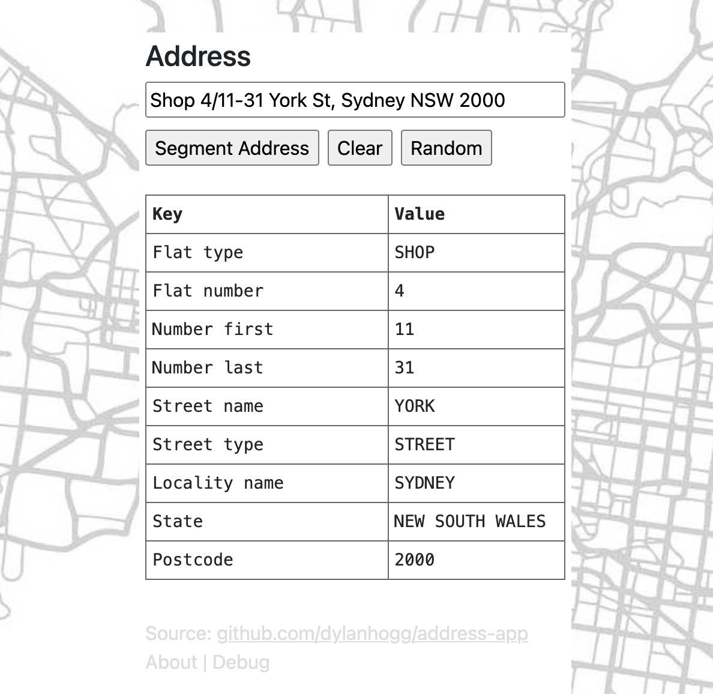

# Address App

TLDR: Mapping free-text address -> Structured fields using machine learning.

This project has an api and application to map free-text street addresses to structured Australian [GNAF](https://geoscape.com.au/data/g-naf/) fields.

It borrows heavily from the excellent [address-net](https://github.com/jasonrig/address-net) project and uses a pretrained Tensorflow model to parse and segment the free text address.



## Working examples

Application: https://address-app.infocruncher.com/

Api: https://address-api.infocruncher.com/


## Project Structure

### App

The `/client` folder is a [Terraform](https://www.terraform.io/) managed S3 website app hosted at [address-app.infocruncher.com](https://address-app.infocruncher.com/) that uses the [api](https://address-api.infocruncher.com/) endpoint. 

See `/client/Makefile` for more information around deploying the app to AWS.


### Api

The project root is an [AWS SAM](https://aws.amazon.com/serverless/sam/) managed API [address-api.infocruncher.com](https://address-api.infocruncher.com/) consisting of an API Gateway with Lambda backend. 

The actual app that is deployed to Lambda is Dockerised and can be found in `/app` 

See `/Makefile` for more information around deploying the api to AWS.

Example Api response given a POST request with `Unit 18/14-18 Flood St, Bondi, NSW 2026`:

```
{
  "address": "Unit 18/14-18 Flood St, Bondi, NSW 2026",
  "result": {
    "flat_type": "UNIT",
    "flat_number": "18",
    "number_first": "14",
    "number_last": "18",
    "street_name": "FLOOD",
    "street_type": "STREET",
    "locality_name": "BONDI",
    "state": "NEW SOUTH WALES",
    "postcode": "2026"
  },
  "handler_time": "0:00:01.180911",
  "runtime_time": "0:04:24.914928",
  "model_dir": "/opt/ml/model/pretrained",
  "version": "0.1.11"
}
```
